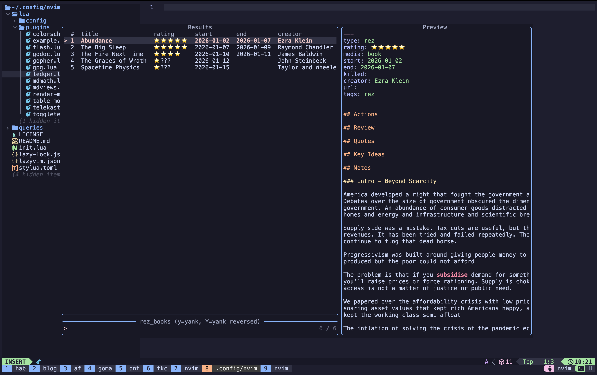

# MdViews

A pure Lua plugin for querying and displaying markdown files in a picklist by
their YAML frontmatter properties. Inspired by Obsidian's Dataview plugin, but
neovim-native, lightweight, and faster. Using telescope and envisioned to be
used with [Telekasten](https://github.com/nvim-telekasten/telekasten.nvim)



This is my first Neovim (and Lua!) plugin, so please be gentle.

It is part of my project to make nvim more of a LifeOS and is meant to be used
alongside the excellent telekasten plugin. In particular, I needed this to make
my [Resonance Calendar](https://www.youtube.com/watch?v=lKYBB-Uw1IM) available
in nvim. Huge thanks to the hard work of the excellent authors of Telekasten
which I curently use this as an extension with.

## Features

- **Pure Lua** - No external dependencies
- **YAML Frontmatter Parsing** - Parses dates, booleans, numbers, strings, and
  lists
- **Flexible Queries** - Filter, sort, select and suppress display of fields
  from your markdown files
- **Telescope Integration** - Browse results with preview and quick navigation
- **Floating Window** - Alternative display mode for quick viewing
- **Predefined Views** - Configure queries for direct access

## Installation

Using [lazy.nvim](https://github.com/folke/lazy.nvim):

```lua
{
  "github.com/wakatara/MdViews",  -- or use dir = "~/path/to/MdViews" for local dev
  dependencies = {
    "nvim-telescope/telescope.nvim",
  },
  cmd = { "MdViews", "MdViewsQuery" },
  keys = {
    { "<leader>zv", "<cmd>MdViews pick<CR>", desc = "MdViews: Pick view" },
  },
  config = function()
    local mdviews = require("mdviews")

    mdviews.setup({
      home = "~/Documents/notes",
      display = "telescope",  -- or "float"
      views = {
        -- Define your views here
      },
    })
  end,
}
```

## Configuration

### Basic Setup

```lua
require("mdviews").setup({
  -- Base directory for relative paths
  home = "~/Documents/notes",

  -- Default display mode: "telescope" or "float"
  display = "telescope",

  -- Predefined views
  views = {
    my_books = {
      description = "All books",
      from = "refs/books",
      fields = { "title", "author", "rating", "start", "end" },
      where = { type = "book" },
      sort = { field = "start", order = "desc" },
    },
  },
})
```

### View Options

Each view can have the following options:

| Option           | Type     | Description                                            |
|------------------|----------|--------------------------------------------------------|
| `from`           | string   | Directory to scan (relative to `home` or absolute)     |
| `fields`         | string[] | Fields to select from frontmatter (used for filtering) |
| `display_fields` | string[] | Fields to display (defaults to `fields` if omitted)    |
| `where`          | table    | Filter conditions                                      |
| `sort`           | table    | Sort configuration `{ field, order }`                  |
| `limit`          | number   | Maximum results to return                              |
| `numbered`       | boolean  | Show row numbers (default: false)                      |
| `show_headers`   | boolean  | Show column headers at top (default: false)            |
| `description`    | string   | Description shown in view picker                       |
| `display`        | string   | Override default display mode                          |

**Note:** Use `display_fields` to hide columns you only need for filtering. For example,
if you filter by `type = "project"`, you don't need to display the `type` column since
all results will have the same value.

### Filter Conditions

The `where` table supports several condition types:

```lua
where = {
  -- Direct value match
  type = "book",

  -- Boolean (false matches nil/empty too)
  killed = false,

  -- Function for custom logic
  rating = function(v)
    return v and v:match("⭐️⭐️⭐️⭐️") ~= nil
  end,

  -- Operator conditions
  start = mdviews.gte("2024-01-01"),
  ["end"] = mdviews.exists,
}
```

Available operators:

| Operator | Description |
|----------|-------------|
| `mdviews.eq(value)` | Equal to |
| `mdviews.ne(value)` | Not equal to |
| `mdviews.gt(value)` | Greater than |
| `mdviews.gte(value)` | Greater than or equal |
| `mdviews.lt(value)` | Less than |
| `mdviews.lte(value)` | Less than or equal |
| `mdviews.contains(value)` | String contains / array includes |
| `mdviews.is_in(values)` | Value is in array |
| `mdviews.exists` | Field exists and is not nil |
| `mdviews.not_exists` | Field is nil or missing |

## Commands

| Command | Description |
|---------|-------------|
| `:MdViews` | List available views |
| `:MdViews pick` | Open Telescope picker to select a view |
| `:MdViews <name>` | Run a specific view by name |
| `:MdViewsQuery <dir>` | Run ad-hoc query on a directory |

## Keybindings

In the Telescope picker:

| Key | Action |
|-----|--------|
| `<CR>` | Open selected file |
| `y` | Yank results as markdown table to clipboard |
| `Y` | Yank results as markdown table (reversed order) |

In the floating window:

| Key | Action |
|-----|--------|
| `<CR>` | Open selected file |
| `q` / `<Esc>` | Close view |

## Example: Rez (Media Tracking)

Perfect for tracking books, movies, and other media with frontmatter like:

```md
---
type: book
rating: ⭐️⭐️⭐️⭐️
start: 2024-11-03
end: 2024-11-17
killed: false
creator: Michael Pollan
--- 

# The Omnivore's Dilemma 
```

Configure views:

```lua
views = {
  rez_books = {
    description = "Resonance Cal Books",
    from = "Refs/rez",
    fields = { "title", "type", "rating", "start", "end", "creator" },
    display_fields = { "title", "rating", "start", "end", "creator" },  -- Hide 'type'
    where = {
      type = function(v)
        return v == "book" or v == "audiobook"
      end,
    },
    sort = { field = "start", order = "asc" },
    numbered = true,
    show_headers = true,
  },

  projects = {
    description = "Active Projects",
    from = "Projects",
    fields = { "title", "type", "start", "end" },
    display_fields = { "title", "start", "end" },  -- Hide 'type' column
    where = {
      type = "project",
    },
    sort = { field = "start", order = "asc" },
    show_headers = true,
  },
}
```

## License

MIT
